# Python + Agents (Session 1): 🛠️ Building your first agent in Python

📺 [Watch the full recording on YouTube](https://www.youtube.com/watch?v=I4vCp9cpsiI) |
📑 [Download the slides (PPTX)](https://aka.ms/pythonagents/slides/building)

This write-up includes an annotated version of the presentation slides with timestamps to the video plus a summary of the live Q&A sessions.

## Table of contents

- [Session description](#session-description)
- [Annotated slides](#annotated-slides)
  - [Overview of the Python + Agents livestream series](#overview-of-the-python--agents-livestream-series)
  - [Building your first agent in Python: session topics](#building-your-first-agent-in-python-session-topics)
  - [Running code examples using GitHub Codespaces](#running-code-examples-using-github-codespaces)
  - [Agents 101: what is an agent?](#agents-101-what-is-an-agent)
  - [Why do we need agents with tools?](#why-do-we-need-agents-with-tools)
  - [Popular Python AI agent frameworks overview](#popular-python-ai-agent-frameworks-overview)
  - [Tool calling without an agent framework](#tool-calling-without-an-agent-framework)
  - [Understanding the tool calling flow](#understanding-the-tool-calling-flow)
  - [Defining callable functions for the LLM](#defining-callable-functions-for-the-llm)
  - [Extracting function calls from the LLM response](#extracting-function-calls-from-the-llm-response)
  - [Invoking local Python functions based on LLM suggestions](#invoking-local-python-functions-based-on-llm-suggestions)
  - [Sending tool results back to the LLM for response generation](#sending-tool-results-back-to-the-llm-for-response-generation)
  - [Benefits of using the Microsoft agent framework](#benefits-of-using-the-microsoft-agent-framework)
  - [Installing Microsoft agent framework packages](#installing-microsoft-agent-framework-packages)
  - [Building an agent with a single tool using decorators](#building-an-agent-with-a-single-tool-using-decorators)
  - [Single tool agent example: weather function](#single-tool-agent-example-weather-function)
  - [Adding multiple tools to an agent to increase power](#adding-multiple-tools-to-an-agent-to-increase-power)
  - [Multi-tool agent example with date, weather, and activities](#multi-tool-agent-example-with-date-weather-and-activities)
  - [Using DevUI for local experimentation and debugging](#using-devui-for-local-experimentation-and-debugging)
  - [Integrating agents with MCP server tools](#integrating-agents-with-mcp-server-tools)
  - [Running a local MCP server example](#running-a-local-mcp-server-example)
  - [Connecting to remote MCP servers for documentation queries](#connecting-to-remote-mcp-servers-for-documentation-queries)
  - [Challenges with large MCP server definitions and token limits](#challenges-with-large-mcp-server-definitions-and-token-limits)
  - [Agent middleware: concepts and types](#agent-middleware-concepts-and-types)
  - [Middleware implementation examples](#middleware-implementation-examples)
  - [Use cases and benefits of middleware](#use-cases-and-benefits-of-middleware)
  - [Basic multi-agent architecture with supervisor and specialist agents](#basic-multi-agent-architecture-with-supervisor-and-specialist-agents)
  - [Demonstration of multi-agent setup in code](#demonstration-of-multi-agent-setup-in-code)
  - [Final slides, resources, and next steps](#final-slides-resources-and-next-steps)
- [Live Chat Q&A](#live-chat-qa)
- [Discord Office Hours Q&A](#discord-office-hours-qa)

## Session description

In the first session of our Python + Agents series, we kicked things off with the fundamentals: what AI agents are, how they work, and how to build your first one using the Microsoft Agent Framework.

We started with the core anatomy of an agent, then walked through how tool calling works in practice—beginning with a single tool, expanding to multiple tools, and finally connecting to tools exposed through local MCP servers.

We concluded with the supervisor agent pattern, where a single supervisor agent coordinates subtasks across multiple subagents, by treating each agent as a tool.

Along the way, we shared tips for debugging and inspecting agents, like using the DevUI interface from Microsoft Agent Framework for interacting with agent prototypes.

## Annotated slides

### Overview of the Python + Agents livestream series

  
[Watch from 00:53](https://www.youtube.com/watch?v=I4vCp9cpsiI&t=53s)

This series spans six live sessions over two weeks, focusing on building AI agents and workflows with Python and the Microsoft Agent Framework. Week one emphasizes core agent building blocks: adding tools, context, and memory, plus evaluating and monitoring agents. Week two covers more advanced workflows involving conditionals, concurrent agents, consensus mechanisms, and human-in-the-loop integration. The framework supports both Python and .NET, enabling developers to build sophisticated applications atop generative AI technology.

### Building your first agent in Python: session topics

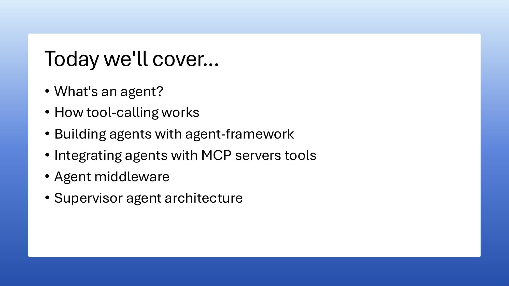  
[Watch from 03:16](https://www.youtube.com/watch?v=I4vCp9cpsiI&t=196s)

The session covers defining agents, understanding tools and tool calling, building agents with the Microsoft Agent Framework, integrating with MCP servers, using middleware to intercept agent execution, and creating a basic multi-agent architecture. It provides a foundation for practical agent development and integration in real-world applications.

### Running code examples using GitHub Codespaces

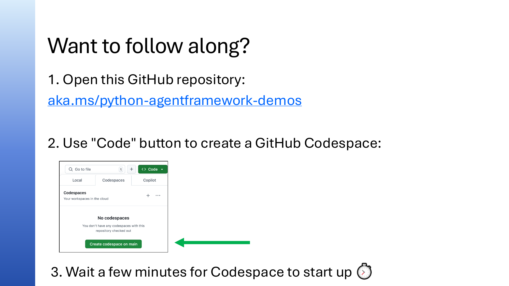  
[Watch from 04:25](https://www.youtube.com/watch?v=I4vCp9cpsiI&t=265s)

Developers can follow along by opening the provided GitHub repository using Codespaces, a cloud-based VS Code environment. Codespaces automatically configures dependencies including Python packages, the agent framework, and supporting services like PostgreSQL and Redis. This setup simplifies running examples without local installation. Free GitHub models provide the underlying LLMs needed to execute the agents. Users are guided to create a Codespace from the main branch and wait a few minutes for the environment to load fully.

### Agents 101: what is an agent?

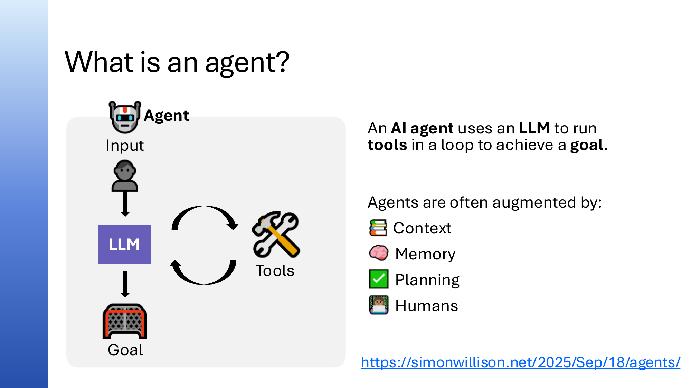  
[Watch from 07:24](https://www.youtube.com/watch?v=I4vCp9cpsiI&t=444s)

An agent is defined as an LLM that runs tools in a loop to achieve a goal. This simple definition encapsulates a powerful concept: the LLM selects appropriate tools, calls them with suitable arguments, receives results, and iterates until the objective is met. Effective agents depend on having the right tools with accurate knowledge and a capable LLM that can orchestrate tool usage. Agents can be augmented with context, memory, explicit planning, and human feedback to enhance their capabilities beyond this core loop.

### Why do we need agents with tools?

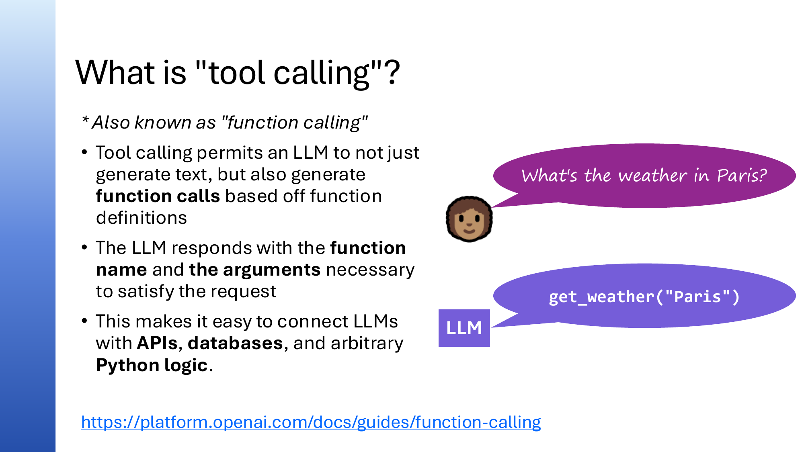  
[Watch from 09:53](https://www.youtube.com/watch?v=I4vCp9cpsiI&t=593s)

Agents without tools are limited to their pretrained knowledge and often hallucinate or provide outdated answers. For example, an agent asked about the weather without a weather tool cannot fetch live data and might guess incorrectly. Equipping agents with tools allows them to ground their answers in real-time, domain-specific data and reduces hallucinations. Tools empower agents to solve practical problems in specialized domains by extending beyond their base language model capabilities.

### Popular Python AI agent frameworks overview

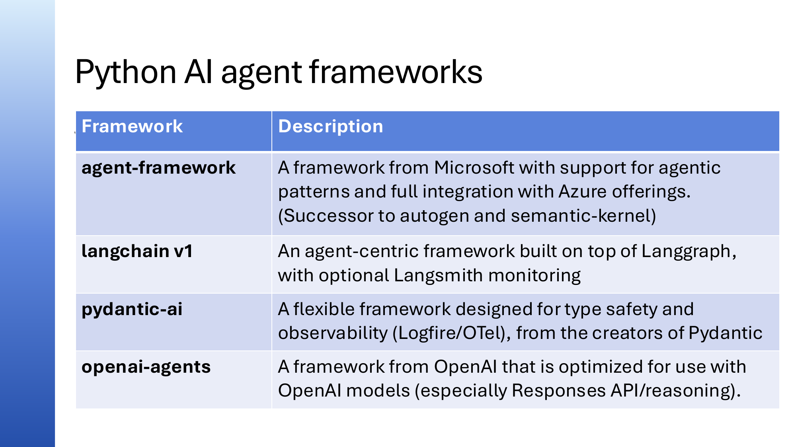  
[Watch from 13:43](https://www.youtube.com/watch?v=I4vCp9cpsiI&t=823s)

Several Python frameworks support building AI agents, each with distinct features:

- **Microsoft Agent Framework**: Successor to AutoGen and Semantic Kernel, offering modern, flexible, and feature-rich tooling.
- **Langchain v1**: Agent-centric open-source framework integrating with Langraph for monitoring and deployment.
- **Pydantic AI**: Focuses on type safety and integrates well with Python typing.
- **OpenAI agents**: Simpler, less flexible but suitable for basic OpenAI model use cases.

This talk uses Microsoft Agent Framework for its advanced capabilities and ongoing development.

### Tool calling without an agent framework

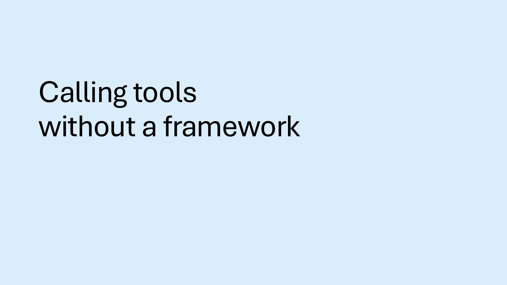  
[Watch from 16:07](https://www.youtube.com/watch?v=I4vCp9cpsiI&t=967s)

Tool calling is a core ability that enables an LLM to invoke external functions. Without a framework, developers must manually define JSON schema descriptions of tools, parse the LLM's function call responses (which include function name and arguments), invoke corresponding local functions, and feed the results back to the LLM to generate final answers. This involves careful serialization, deserialization, and error handling, which can be complex and error-prone.

### Understanding the tool calling flow

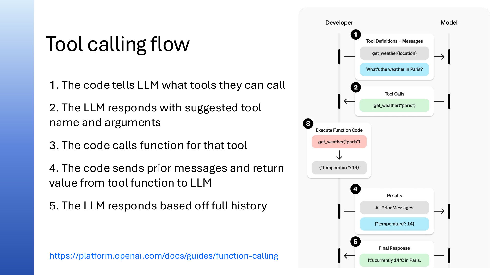  
[Watch from 19:17](https://www.youtube.com/watch?v=I4vCp9cpsiI&t=1157s)

The tool calling process involves:

1. Defining tool schemas that describe available functions and their parameters.
2. Sending the user query and tool definitions to the LLM.
3. The LLM suggesting which tool to call and with what arguments.
4. The agent code executing the specified function locally.
5. Returning the function's output to the LLM.
6. The LLM generating a natural language response based on the results.

The LLM itself never executes code but decides the tool invocation plan.

### Defining callable functions for the LLM

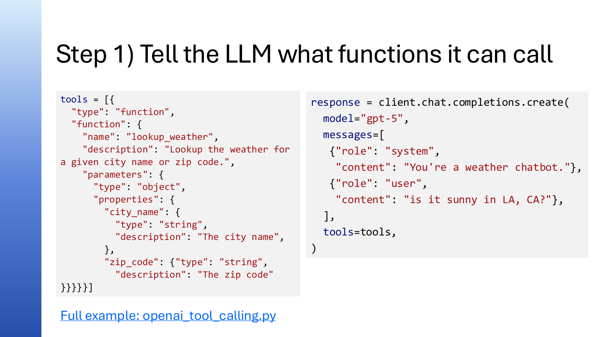  
[Watch from 21:17](https://www.youtube.com/watch?v=I4vCp9cpsiI&t=1277s)

Functions exposed to the LLM must be described via JSON schema, including the function name, descriptions, parameter names, types, and documentation. The LLM sees this schema, not the underlying code. Properly annotating argument types and descriptions improves the LLM's understanding of how to call the tools effectively.

### Extracting function calls from the LLM response

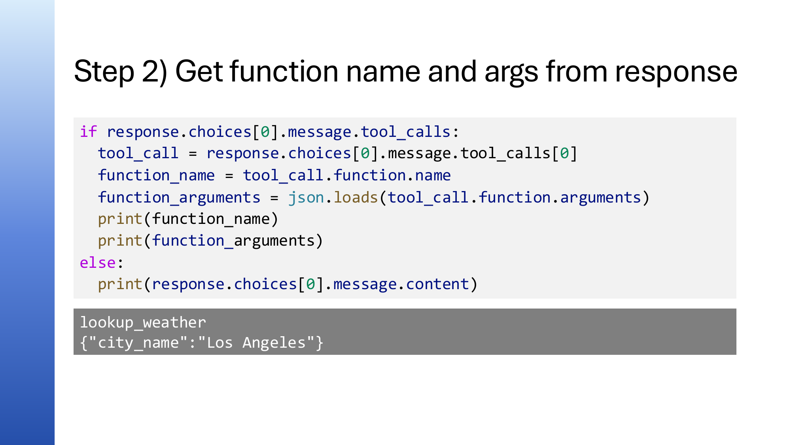  
[Watch from 22:56](https://www.youtube.com/watch?v=I4vCp9cpsiI&t=1376s)

When the LLM responds, it may include a suggested function call encoded in JSON. The agent must parse this response to extract the function name and arguments, deserialize the JSON, and verify that the function is recognized locally.

### Invoking local Python functions based on LLM suggestions

  
[Watch from 23:41](https://www.youtube.com/watch?v=I4vCp9cpsiI&t=1421s)

After parsing, the agent calls the corresponding local Python function with the extracted arguments. The function runs in the agent's environment, producing output that is then sent back to the LLM for further processing and to generate the final answer.

### Sending tool results back to the LLM for response generation

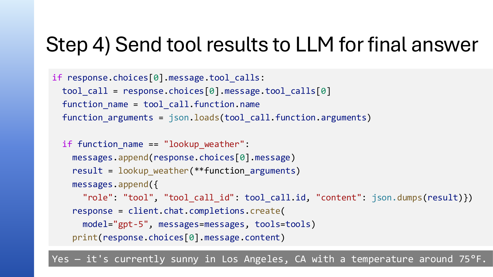  
[Watch from 24:27](https://www.youtube.com/watch?v=I4vCp9cpsiI&t=1467s)

The LLM receives the tool output and integrates it into a coherent natural language response. This completes one iteration of the agent's tool-calling loop.

### Benefits of using the Microsoft agent framework

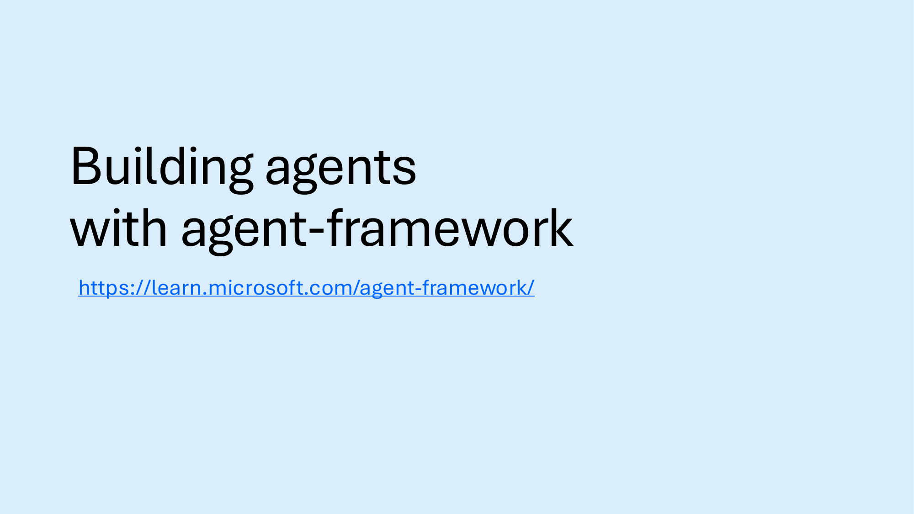  
[Watch from 24:27](https://www.youtube.com/watch?v=I4vCp9cpsiI&t=1467s)

The agent framework abstracts away the complexity of manual tool calling, including schema management, response parsing, error handling, and orchestration. It provides decorators to easily mark Python functions as tools, automatically generating schemas and managing calls. This reduces boilerplate and development effort, enabling rapid agent creation.

### Installing Microsoft agent framework packages

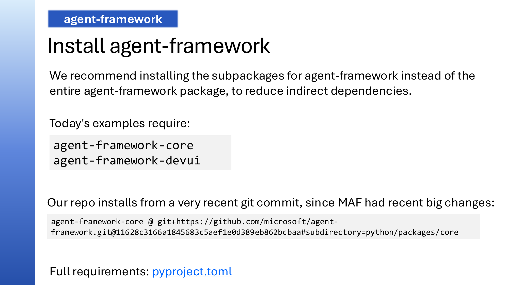  
[Watch from 25:20](https://www.youtube.com/watch?v=I4vCp9cpsiI&t=1520s)

The framework is modular with a core package and sub-packages. For this session, only `agent-framework-core` and `agent-framework-devui` are installed. The latest development version is pulled directly from GitHub to capture rapid updates, though official versioned releases are forthcoming. Installation is managed via `uv` (a Rust-based Python environment manager) for fast and reliable setup.

### Building an agent with a single tool using decorators

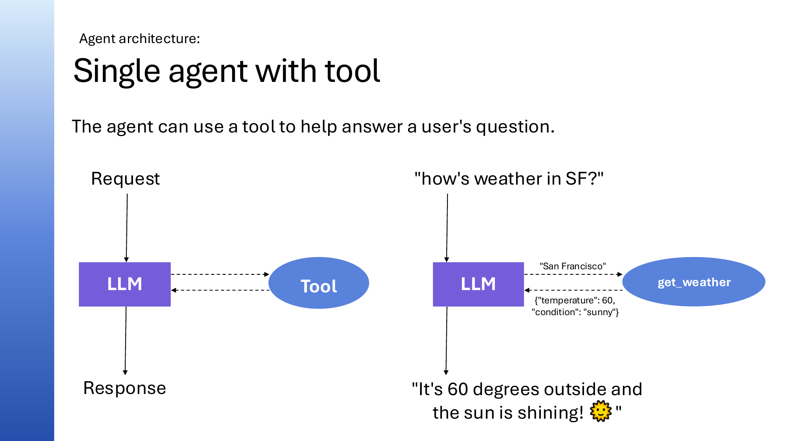  
[Watch from 27:20](https://www.youtube.com/watch?v=I4vCp9cpsiI&t=1640s)

Agents are constructed by defining Python functions decorated with `@tool` from the agent framework. This decorator signals the framework to treat the function as a callable tool, generating appropriate JSON schema from the function's argument annotations and docstrings. Rich argument metadata helps the LLM choose and invoke the tool correctly.

### Single tool agent example: weather function

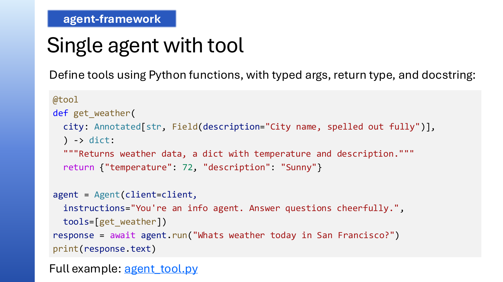  
[Watch from 31:14](https://www.youtube.com/watch?v=I4vCp9cpsiI&t=1874s)

A weather agent includes a function that takes a city name as a string, annotated with descriptions to inform the LLM. The agent is created by passing the LLM client, system prompt, and a list containing this tool function. Running the agent executes the tool calling loop automatically, producing weather responses with simulated or randomized data.

### Adding multiple tools to an agent to increase power

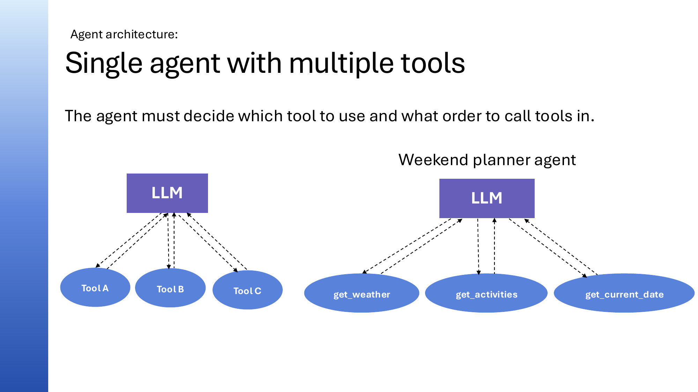  
[Watch from 32:56](https://www.youtube.com/watch?v=I4vCp9cpsiI&t=1976s)

Agents become significantly more capable with multiple tools. For example, a weekend planner agent may include tools to get the current date, retrieve weather conditions, and suggest activities based on location and date. The LLM decides which tools to call, in what order, and how many times, enabling dynamic and context-aware interactions.

### Multi-tool agent example with date, weather, and activities

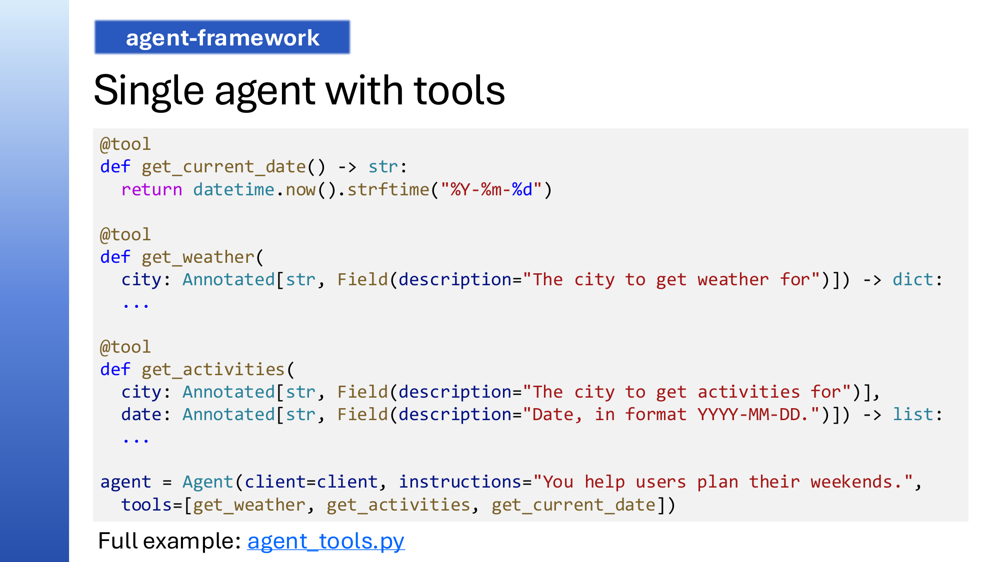  
[Watch from 33:44](https://www.youtube.com/watch?v=I4vCp9cpsiI&t=2024s)

Each tool is defined as a decorated function with detailed type annotations and descriptions. The agent receives all tools as a list. The LLM intelligently sequences calls: it fetches the current date, then weather, then activities for specific weekend dates, sometimes invoking tools multiple times for different days. This showcases the agent’s reasoning and planning capabilities.

### Using DevUI for local experimentation and debugging

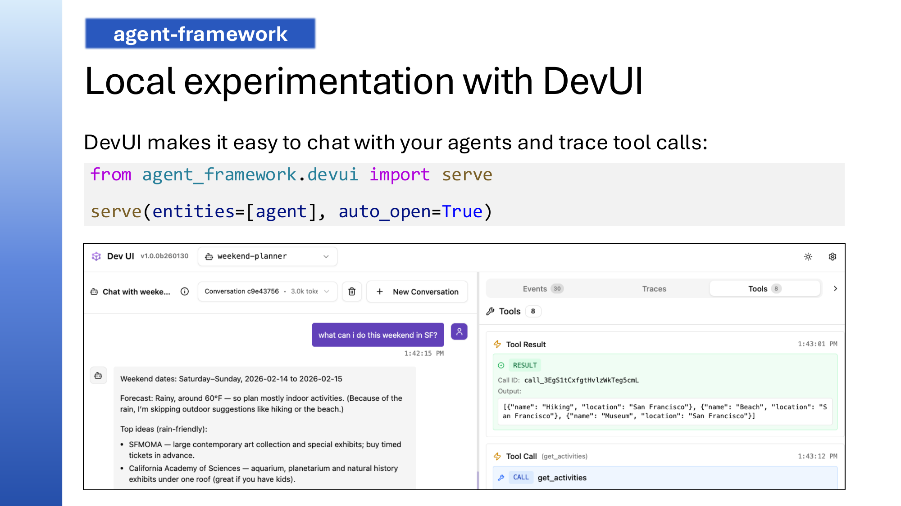  
[Watch from 38:33](https://www.youtube.com/watch?v=I4vCp9cpsiI&t=2313s)

DevUI is a local web-based playground included with the agent framework’s dev package. It allows interactive chatting with agents, displaying detailed logs of tool calls, arguments, responses, and token usage in real time. Developers can easily experiment with inputs, observe tool invocation sequences, and trace event streams for debugging and development without modifying code.

### Integrating agents with MCP server tools

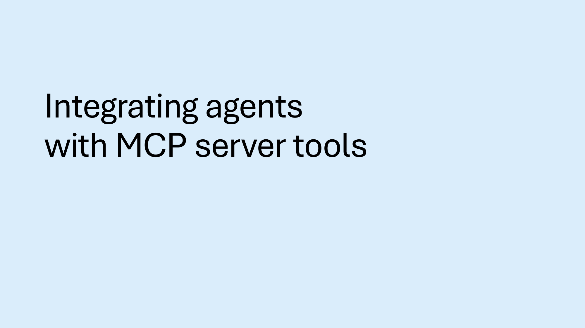  
[Watch from 43:07](https://www.youtube.com/watch?v=I4vCp9cpsiI&t=2587s)

The Model Context Protocol (MCP) is an open standard for LLMs to interact with external tools and data sources via defined servers. Agents can act as MCP clients, querying servers for available tools and invoking them remotely. This enables leveraging existing, possibly complex, external services as tools without embedding them locally.

### Running a local MCP server example

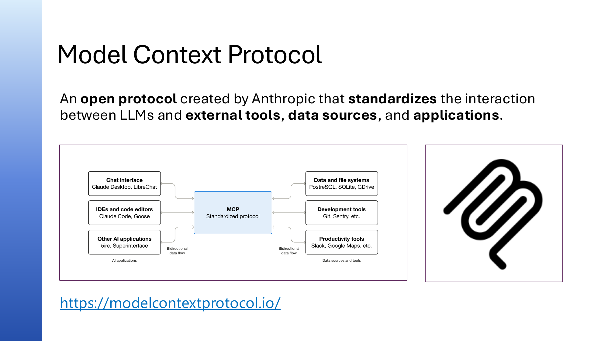  
[Watch from 45:29](https://www.youtube.com/watch?v=I4vCp9cpsiI&t=2729s)

A local MCP server is launched exposing a tool, such as adding expenses to a file. The agent connects to this server via its URL, retrieves tool definitions, and can call the remote tool as if it were local. This decouples tool implementation from the agent and allows reuse of services hosted anywhere, including cloud environments.

### Connecting to remote MCP servers for documentation queries

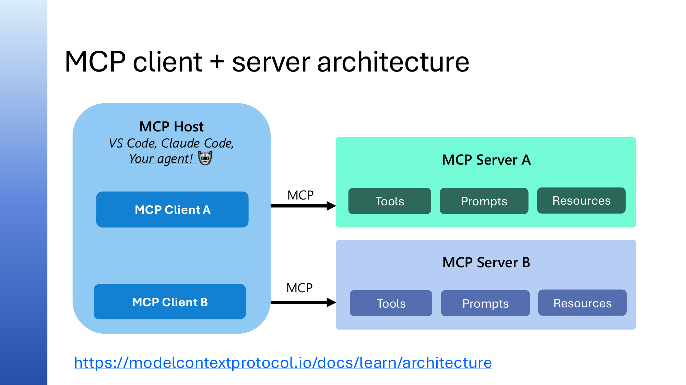  
[Watch from 48:36](https://www.youtube.com/watch?v=I4vCp9cpsiI&t=2916s)

Agents can connect to public MCP servers, such as Microsoft's Learn server, which provides access to extensive documentation tools without authentication. The agent uses these tools to answer domain-specific questions, like Azure CLI commands. However, large MCP server schemas can cause token limit issues, especially with models that have lower token capacity.

### Challenges with large MCP server definitions and token limits

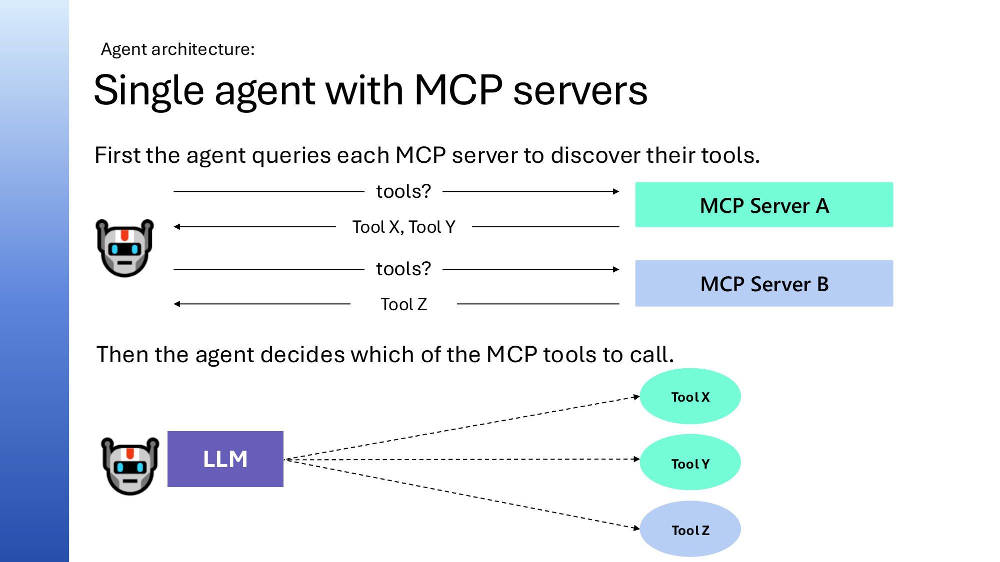  
[Watch from 50:21](https://www.youtube.com/watch?v=I4vCp9cpsiI&t=3021s)

MCP server tool definitions may be large, consuming many tokens when sent to the LLM. This can result in exceeding model token limits, causing errors. Using models with higher token capacities (e.g., gpt-4.1-mini) mitigates this. Developers must be aware of token constraints and possibly optimize tool schemas or model choices accordingly.

### Agent middleware: concepts and types

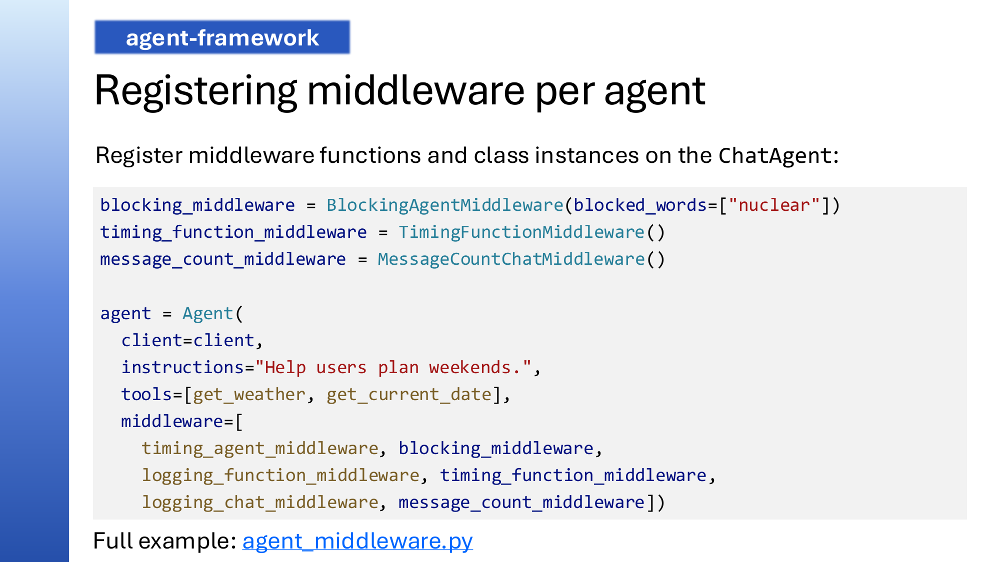  
[Watch from 53:00](https://www.youtube.com/watch?v=I4vCp9cpsiI&t=3180s)

Middleware provides hooks to intercept and modify agent execution at three levels: agent middleware, chat middleware, and function middleware. Each operates at different abstraction layers and receives distinct context objects. Middleware enables logging, monitoring, modifying inputs/outputs, enforcing policies, and augmenting behavior dynamically during an agent's run.

### Middleware implementation examples

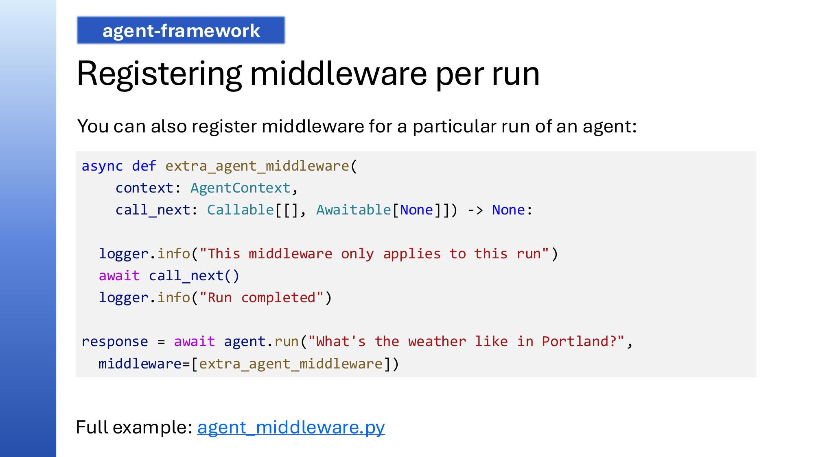  
[Watch from 55:00](https://www.youtube.com/watch?v=I4vCp9cpsiI&t=3300s)

Middleware functions follow a pattern: they receive context and a next-callable, perform pre-processing, invoke the next step to continue the chain, then post-process results. They can be implemented as simple async functions or as classes inheriting from middleware base classes, supporting initialization, state, and termination control. Middleware can modify inputs, track timing, block requests, or handle errors.

### Use cases and benefits of middleware

  
[Watch from 56:53](https://www.youtube.com/watch?v=I4vCp9cpsiI&t=3413s)

Middleware is useful for logging, timing, blocking unsafe content, summarizing conversations, dynamic system prompt injection, PII redaction, model fallback strategies, token limiting, security checks, and retry logic. Middleware can be shared across agents within organizations, promoting code reuse and consistency. It greatly enhances agent flexibility and control, especially in complex production scenarios.

Middleware can set a termination flag to stop the agent's execution early, useful for safety checks, quota enforcement, or blocking undesired requests. Middleware can also be packaged and shared within organizations, allowing consistent logging, security, and behavior modifications across different agents.

### Basic multi-agent architecture with supervisor and specialist agents

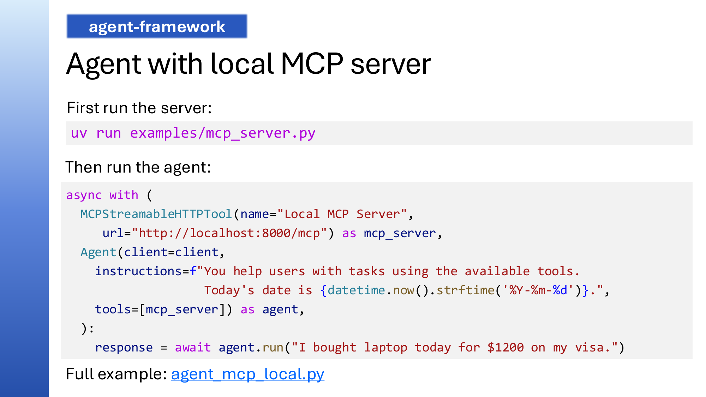  
[Watch from 58:37](https://www.youtube.com/watch?v=I4vCp9cpsiI&t=3517s)

Multi-agent setups involve a supervisor agent delegating tasks to specialized sub-agents based on the query. In this example, a parenting helper agent routes requests to a weekend planner agent or a meal planner agent. Each sub-agent is wrapped as a tool, allowing the supervisor to invoke them as if calling a function. This pattern supports modularity and task-specific expertise.

### Demonstration of multi-agent setup in code

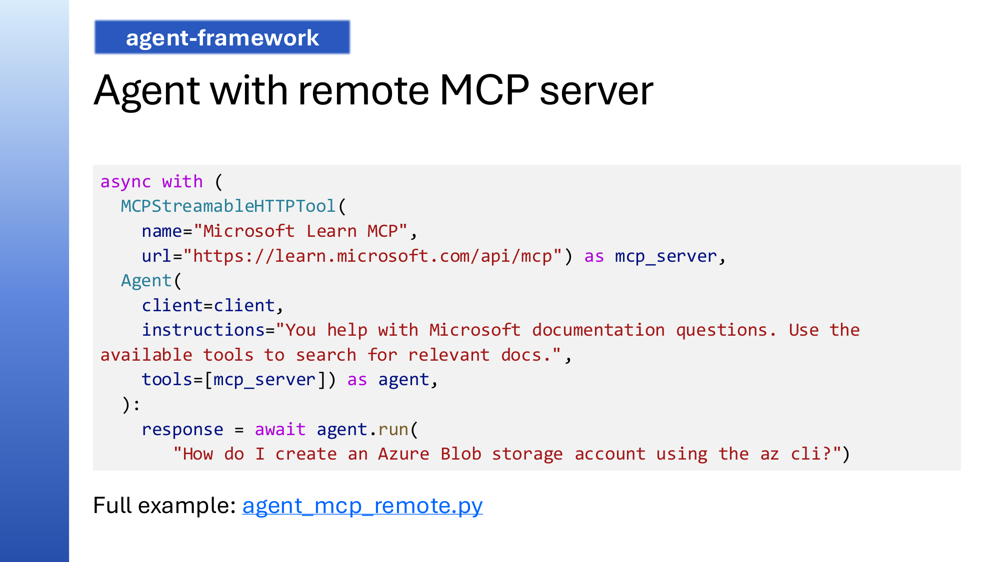  
[Watch from 01:00:36](https://www.youtube.com/watch?v=I4vCp9cpsiI&t=3636s)

The supervisor agent is instantiated with references to its sub-agents, each decorated as a tool. It receives user input and chooses which sub-agent to invoke based on the task. This simple architecture allows discrete task handling but may require more sophisticated orchestration for complex workflows, covered in later sessions.

### Final slides, resources, and next steps

  
[Watch from 01:01:02](https://www.youtube.com/watch?v=I4vCp9cpsiI&t=3662s)

The session concludes with links to slides, code repositories, and upcoming live streams. Participants are encouraged to register for the series, join Discord office hours for questions, and explore additional resources. Future sessions will cover adding context and memory to agents and advanced workflow orchestration.

## Live Chat Q&A

### What model is used in the examples?

The primary model used is an Azure-deployed gpt-5-mini. For some examples, such as those with large token requirements, gpt-4.1-mini is used. GitHub models are also available but can have token limits impacting large tool schemas.

### How does the agent choose between multiple MCP servers exposing overlapping tools?

Agents rely on clear, specific tool names and descriptions to distinguish tools. When multiple servers have overlapping capabilities, system prompts can instruct the agent which server's tool to prefer. Proper MCP server design and prompt engineering help reduce ambiguity.

## Discord Office Hours Q&A

### How does middleware work in the Agent Framework?

📹 [0:01](https://youtube.com/watch?v=6HzauGnbRwA&t=1)

The Agent Framework supports three types of middleware, each operating at a different level:

- **Agent context middleware** — runs before and after `agent.run()`. You get access to the agent, messages, session (chat history), and options (e.g., whether streaming is enabled). You can override the result or modify options after the agent runs.
- **Function context middleware** — sits between the LLM calls and the tool/function calls. Useful for security-related concerns like permission checking, human-in-the-loop approvals, limiting the number of tool calls (e.g., cutting off a deep researcher after 12 tool calls), and tool retry logic.
- **Chat context middleware** — operates on the chat level, where you can override or filter the LLM's response (e.g., PII reduction).

All three middleware types let you mutate the result if needed. You can define middleware using simple functions or classes.

### Why do the tools in the demos have hard-coded return values?

📹 [4:01](https://youtube.com/watch?v=6HzauGnbRwA&t=241)

The demo tools return hard-coded values so they work without requiring API keys. For a real implementation, you'd replace the hard-coded returns with actual API calls (e.g., `requests.get()` to a weather API). Most weather APIs require keys, so the demos avoid that dependency.

### How does "context" differ across frameworks?

📹 [5:11](https://youtube.com/watch?v=6HzauGnbRwA&t=311)

The word "context" is extremely overloaded in the AI/agent space. In the Agent Framework specifically:

- **Context** (as in context providers) — information that always gets passed into the agent, as opposed to tools where definitions are passed but may or may not get called. This is covered more in the session on context and memory.
- **Middleware context** — the context object passed to middleware, giving it access to what it needs to operate (agent context, function context, chat context).

Every framework uses "context" differently, and even within a single framework it can mean different things depending on where it appears.

### What should I do if I get an "unavailable model" error with GPT-5 Mini?

📹 [6:52](https://youtube.com/watch?v=6HzauGnbRwA&t=412)

GPT-5 Mini access may be more restricted for some users on GitHub Models. Workarounds:

1. Check the [GitHub Marketplace models page](https://github.com/marketplace?type=models) to see if your account can access it
2. Create a `.env` file and set `GITHUB_MODEL` to a different model (e.g., `gpt-4o`)
3. Set the environment variable directly: `GITHUB_MODEL=gpt-4o`

All the examples in the repo check for a `GITHUB_MODEL` environment variable and fall back to a default. If deploying to Azure, GPT-5 Mini doesn't require an access request form and is available in many regions.

### Is it possible to see the full information sent to the LLM?

📹 [9:52](https://youtube.com/watch?v=6HzauGnbRwA&t=592)

Yes — set the logging level to debug:

```python
import logging
logging.basicConfig(level=logging.DEBUG)
```

This shows the full HTTP request being sent to the chat completions endpoint, including the JSON data with the conversation, model, streaming settings, and tool definitions. Since the Agent Framework wraps the OpenAI SDK, setting debug logging will show what's sent to the LLM.

Seeing the **response body** is harder — the repo's AGENTS.md file has tips for how to inspect response bodies with various SDKs. Open Telemetry tracing (covered in the Thursday session) provides another way to see this information.

### Were these examples hand-coded or vibe-coded?

📹 [13:54](https://youtube.com/watch?v=6HzauGnbRwA&t=834)

A mix. The earlier examples shown in the session were mostly hand-coded. For later, more complex examples, the process was collaborative with GitHub Copilot:

1. Use **plan mode** in GitHub Copilot
2. Provide an outline and point the agent to the most similar existing examples
3. Do a lot of back-and-forth on the plan before implementing
4. Let the agent generate the code based on the agreed-upon plan

It's described as a collaborative process rather than pure "vibe coding."

### Do you recommend starting with a deployed model (Azure Foundry) for learning agents?

📹 [15:53](https://youtube.com/watch?v=6HzauGnbRwA&t=953)

Yes, deploying sooner is better because:

- **GitHub Models rate limits** are reached quickly with agent workloads since agents use a lot of tokens
- **Local small models** generally aren't good enough for reliable tool calling (at least on typical developer machines)
- **Frontier models** (GPT-5 Mini, GPT-4o, etc.) provide the best tool calling support

Even $20 worth of credits goes a long way. You can use Azure, OpenAI directly, or both. The repo's README has instructions for deploying to Azure with `azd login` and `azd provision`.

### Can you use local Ollama models with the Agent Framework?

📹 [17:49](https://youtube.com/watch?v=6HzauGnbRwA&t=1069)

Yes, technically. The question is whether they work well. Tips:

- Use a model that **supports tool calling** — filter for "tools" on [ollama.com](https://ollama.com) models page
- Recommended models for tool calling: **Qwen 3**, **GPT-4All** (if your machine can run it), **GLM models** (if you have sufficient VRAM)
- When running locally, connect via `http://localhost:11434/v1`
- When running inside a **dev container**, use `http://host.docker.internal:11434/v1` instead

A live demo showed Llama 3.1 successfully handling a basic agent example through Ollama.

### Are all the models you're using free?

📹 [25:11](https://youtube.com/watch?v=6HzauGnbRwA&t=1511)

No. The cost breakdown:

- **GitHub Models** — free (used by default in Codespaces), but has rate limits
- **Azure** — not free, but used to avoid rate limits. Uses keyless connections with `DefaultAzureCredential`
- **OpenAI** — not free
- **Ollama** — free (runs on your local machine)

### Does the tracing in Agent Framework work with OpenAI tracing?

📹 [28:00](https://youtube.com/watch?v=6HzauGnbRwA&t=1680)

Probably not directly. Agent Framework uses **Open Telemetry** for tracing, while OpenAI tracing appears to be its own thing (built specifically for the OpenAI Agents SDK). Since the Agent Framework wraps the OpenAI client, there might theoretically be a way to pass tracing info through, but it would likely not work out of the box. This topic is covered more in the Thursday session on Open Telemetry.

### How does the supervisor agent pattern work?

📹 [29:06](https://youtube.com/watch?v=6HzauGnbRwA&t=1746)

A supervisor agent manages multiple specialist agents by wrapping them as tools:

1. The supervisor has instructions describing it manages specialist agents and should decide which to call
2. Each specialist agent is wrapped as a tool function — e.g., `plan_meal` is a tool that runs the meal agent with a query and returns its response
3. The supervisor can potentially call multiple specialist agents, even in parallel

Key observations from the live demo:
- **Parallel tool calling** can happen — OpenAI models support suggesting multiple tool calls in a single response by default
- If the agent doesn't have enough information, it may ask follow-up questions instead of completing the task. You need either a conversation loop or enough detail in the initial prompt.
- Sub-agents are also useful for **reducing the context window**, which will be covered in the session on context and memory.

### Can you use GitHub Copilot models with the Agent Framework?

📹 [36:53](https://youtube.com/watch?v=6HzauGnbRwA&t=2213)

Yes. The Agent Framework has a GitHub Copilot provider:

1. Install the additional package: `agent-framework-github-copilot`
2. Import `GitHubCopilotAgent` instead of the regular `Agent` class
3. The Copilot CLI must be **installed and logged in** in the current environment

It works by wrapping the Copilot CLI binary. In the live demo, it was tricky to get working inside a dev container (required installing the Copilot CLI and logging in within the container). Once set up, you just swap `Agent` with `GitHubCopilotAgent`.

The GitHub Copilot team considers their agent runtime to be among the best available. Note that the Copilot CLI's agentic loop is actually different from VS Code's Copilot agentic loop — they implement things differently despite sharing the product name.

Links shared:

- [Agent Framework GitHub Copilot samples](https://github.com/Azure-Samples/python-agentframework-demos)

### Do you always use Codespaces or only for demos?

📹 [42:20](https://youtube.com/watch?v=6HzauGnbRwA&t=2540)

Lately, more local development instead of Codespaces. The main reason is that `azd login` (Azure Developer CLI login) is harder in Codespaces with the current tenant setup. Working locally (still in a dev container) makes it easier to stay logged into Azure. Codespaces is still liked in general, but the Azure authentication friction has pushed more work to local dev.

### What is YOLO mode in Copilot?

📹 [50:39](https://youtube.com/watch?v=6HzauGnbRwA&t=3039)

YOLO mode auto-approves all tool/command executions without confirmation. It's available both in the **Copilot CLI** and **VS Code** (search for "auto approve" in settings).

Caution: Even inside dev containers and Codespaces, authenticated tools (like the GitHub MCP server) can still perform real actions. The recommendation is to approve commands **per session** (per chat thread) rather than enabling full YOLO mode globally, since authenticated access to services like GitHub means an agent could make real changes.
