# Python + Agents (Session 2): Adding context and memory to agents

📺 [Watch the full recording on YouTube](https://www.youtube.com/watch?v=BMzI9cEaGBM) |
📑 [Download the slides (PPTX)](https://aka.ms/pythonagents/slides/contextmemory)

This write-up includes an annotated version of the presentation slides with timestamps to the video plus a summary of the live Q&A sessions.

## Table of contents

- [Session description](#session-description)
- [Annotated slides](#annotated-slides)
  - [Overview of the Python and agent series](#overview-of-the-python-and-agent-series)
  - [Adding context and memory to agents](#adding-context-and-memory-to-agents)
  - [Agenda: types of context, memory, knowledge providers, and context management](#agenda-types-of-context-memory-knowledge-providers-and-context-management)
  - [Following along with GitHub repository and Codespaces](#following-along-with-github-repository-and-codespaces)
  - [What is an AI agent and why context matters](#what-is-an-ai-agent-and-why-context-matters)
  - [Defining context in AI agents](#defining-context-in-ai-agents)
  - [Understanding different types of memory in AI agents](#understanding-different-types-of-memory-in-ai-agents)
  - [Implementing session memory with conversation sessions](#implementing-session-memory-with-conversation-sessions)
  - [Persistent chat history and database storage options](#persistent-chat-history-and-database-storage-options)
  - [Using Redis for chat history storage](#using-redis-for-chat-history-storage)
  - [Implementing SQLite history provider for persistent chat](#implementing-sqlite-history-provider-for-persistent-chat)
  - [Introduction to dynamic memory in AI agents](#introduction-to-dynamic-memory-in-ai-agents)
  - [Using Redis for dynamic memory with hybrid search](#using-redis-for-dynamic-memory-with-hybrid-search)
  - [Advanced memory management with MemZero package](#advanced-memory-management-with-memzero-package)
  - [Demonstration of MemZero memory provider integration](#demonstration-of-memzero-memory-provider-integration)
  - [Insights from GitHub Copilot’s memory system](#insights-from-github-copilots-memory-system)
  - [Knowledge retrieval in AI agents](#knowledge-retrieval-in-ai-agents)
  - [SQLite knowledge provider example](#sqlite-knowledge-provider-example)
  - [Hybrid search techniques with PostgreSQL](#hybrid-search-techniques-with-postgresql)
  - [Query rewriting for improved knowledge retrieval](#query-rewriting-for-improved-knowledge-retrieval)
  - [Azure AI Search knowledge base integration](#azure-ai-search-knowledge-base-integration)
  - [Key takeaways on knowledge retrieval](#key-takeaways-on-knowledge-retrieval)
  - [Context management challenges and context window limits](#context-management-challenges-and-context-window-limits)
  - [Context compaction and summarization middleware](#context-compaction-and-summarization-middleware)
  - [Using sub-agents to reduce context size](#using-sub-agents-to-reduce-context-size)
  - [Summary and closing remarks](#summary-and-closing-remarks)
- [Live Chat Q&A](#live-chat-qa)
- [Discord Office Hours Q&A](#discord-office-hours-qa)

## Session description

In the second session of our Python + Agents series, we extended agents built with the Microsoft Agent Framework by adding two essential kinds of context: memory and knowledge.

We began with memory—both short‑term, thread‑level context and long‑term, persistent memory.

We showed how agents could store and recall information using solutions like Redis or open‑source libraries such as Mem0, enabling them to remember previous interactions, user preferences, and evolving tasks across sessions.

Next, we explored knowledge, commonly known as Retrieval‑Augmented Generation (RAG), and showed how agents grounded their responses using knowledge retrieved from local data sources such as SQLite or PostgreSQL.

This enabled agents to provide accurate, domain‑specific answers based on real information rather than model hallucination.

By the end, we saw how to build agents that were not only capable but context‑aware and memory‑efficient, resulting in richer, more personalized user experiences.

## Annotated slides

### Overview of the Python and agent series

  
[Watch from 00:05](https://www.youtube.com/watch?v=BMzI9cEaGBM&t=5s)

This series consists of six sessions teaching how to build AI agents using the Microsoft Agent Framework. It spans two weeks and progressively introduces tools, techniques, and best practices for creating intelligent agents capable of handling complex tasks. Registration remains open during the series, providing access to session recordings and resources.

### Adding context and memory to agents

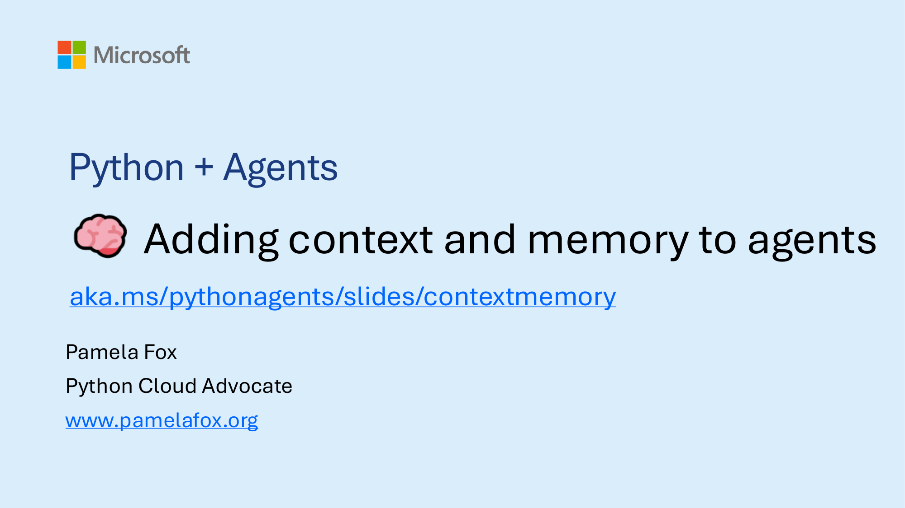  
[Watch from 00:58](https://www.youtube.com/watch?v=BMzI9cEaGBM&t=58s)

This session focuses on enriching AI agents with context and memory to improve their capabilities and user experience. Context here refers broadly to all inputs that influence the agent’s decision-making and responses, while memory enables agents to recall past interactions, user preferences, and relevant knowledge dynamically.

### Agenda: types of context, memory, knowledge providers, and context management

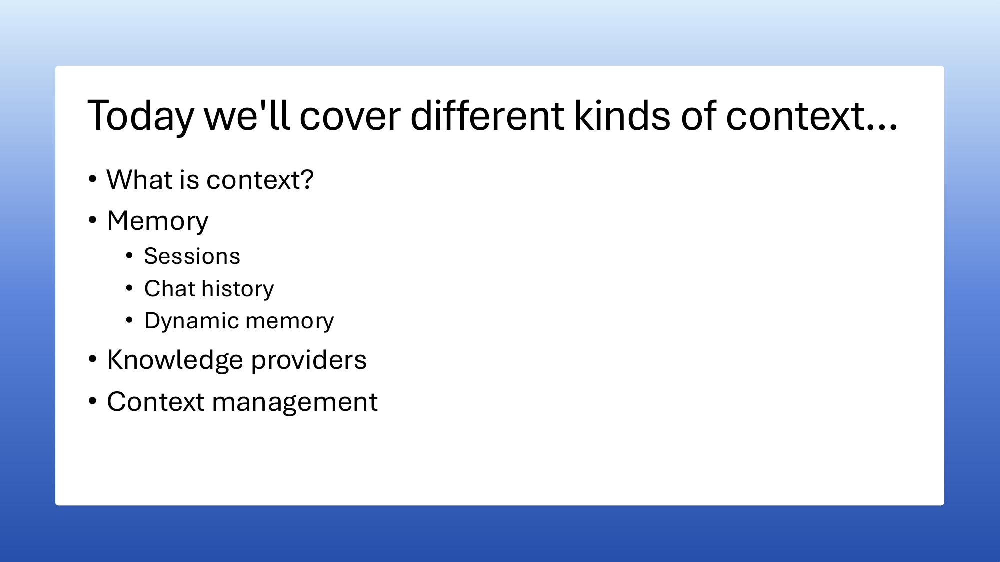  
[Watch from 02:26](https://www.youtube.com/watch?v=BMzI9cEaGBM&t=146s)

The agenda covers defining context in AI agents, exploring various memory types, integrating knowledge providers for retrieval augmented generation (RAG), and managing context size and quality through techniques like summarization and sub-agents. These components collectively empower agents to operate with persistent awareness and domain-relevant knowledge.

### Following along with GitHub repository and Codespaces

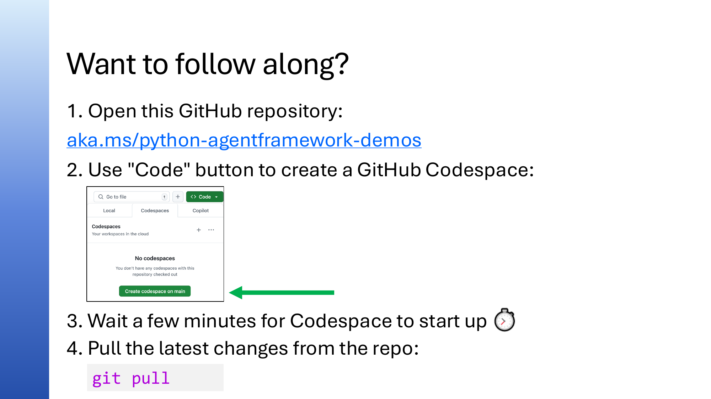  
[Watch from 04:07](https://www.youtube.com/watch?v=BMzI9cEaGBM&t=247s)

A GitHub repository is provided containing all examples and code needed for the session. Users can create a GitHub Codespace from the repository to run the examples without local setup. It’s recommended to perform a `git pull` after starting the Codespace to ensure the latest updates are present. While local setup is possible, it requires additional configuration steps outlined in the repository’s README.

### What is an AI agent and why context matters

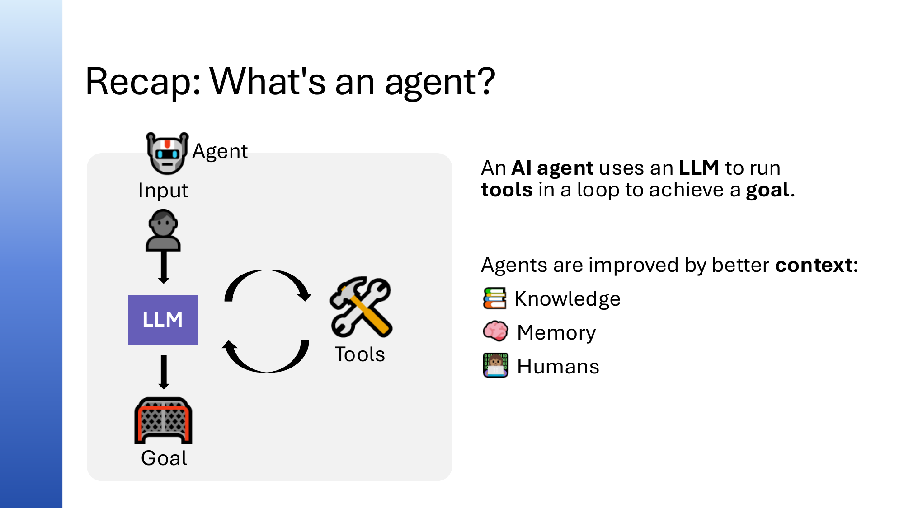  
[Watch from 08:48](https://www.youtube.com/watch?v=BMzI9cEaGBM&t=528s)

An AI agent uses a large language model (LLM) to call tools iteratively toward achieving a user’s goal. Agents can have access to multiple tools and decide dynamically which to invoke. Adding context—such as domain knowledge and conversation history—enables agents to provide more accurate, relevant, and personalized responses beyond tool outputs alone.

### Defining context in AI agents

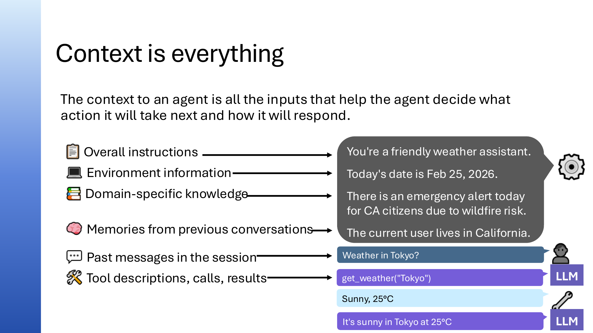  
[Watch from 08:48](https://www.youtube.com/watch?v=BMzI9cEaGBM&t=528s)

Context encompasses all inputs that help an agent decide what action to take and how to respond. This includes:

- System prompts defining agent behavior (e.g., “You are a friendly weather assistant”)
- Environment information like the current date or device type
- Domain-specific knowledge relevant to the agent’s task (e.g., recent events)
- Memories from past conversations about the user to personalize interactions
- The current conversation history itself, including user messages and tool outputs

All of these are combined into the agent’s input to the LLM to improve response quality.

### Understanding different types of memory in AI agents

  
[Watch from 08:48](https://www.youtube.com/watch?v=BMzI9cEaGBM&t=528s)

Memory in agents is categorized into three levels:

1. **Session memory:** The simplest form where the agent remembers all messages and tool calls within the current conversation thread.
2. **Persistent chat history:** The application stores past conversation sessions in a database so users can revisit or continue previous chats.
3. **Dynamic memory:** The agent retains specific facts, preferences, or important information extracted from conversations, stored persistently and searchable to personalize future interactions.

Each type requires different implementation strategies and storage considerations.

### Implementing session memory with conversation sessions

  
[Watch from 11:55](https://www.youtube.com/watch?v=BMzI9cEaGBM&t=715s)

Session memory involves tracking all messages and tool interactions within a single conversation. The Microsoft agent framework provides a `session` abstraction with unique IDs to manage this. By creating a session and passing it with each agent run, the agent maintains full context of the ongoing conversation, enabling accurate follow-up responses. Sessions can be serialized and shared across different agents, making them portable and restorable across time.

### Persistent chat history and database storage options

  
[Watch from 16:18](https://www.youtube.com/watch?v=BMzI9cEaGBM&t=978s)

To remember conversations beyond a single session, chat history must be stored persistently. Design choices include:

- Identifying sessions uniquely in the database
- Deciding whether to store entire threads in one record or split messages across multiple rows
- Ensuring user privacy and secure separation of data
- Supporting search capabilities on stored history if needed

Different databases like Redis, SQLite, Cosmos DB, or PostgreSQL can be used depending on scale, search requirements, and constraints.

### Using Redis for chat history storage

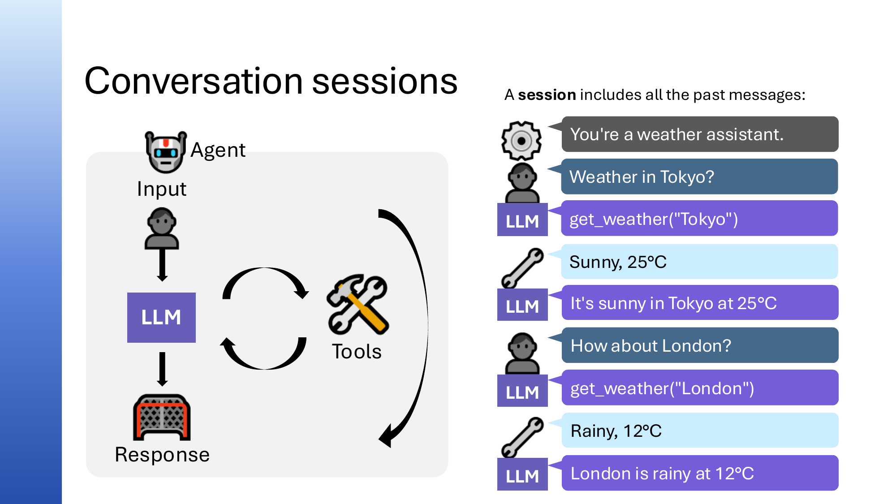  
[Watch from 18:39](https://www.youtube.com/watch?v=BMzI9cEaGBM&t=1119s)

Redis is a fast, in-memory key-value store suitable for storing chat history as a list of messages per session. The agent framework includes a built-in `RedisHistoryProvider` that manages storing and retrieving entire conversation threads keyed by session ID. This approach enables session resumption even after application restarts. In development environments like GitHub Codespaces, Redis can run locally via Docker. For production, managed Redis services such as Azure Redis are recommended.

### Implementing SQLite history provider for persistent chat

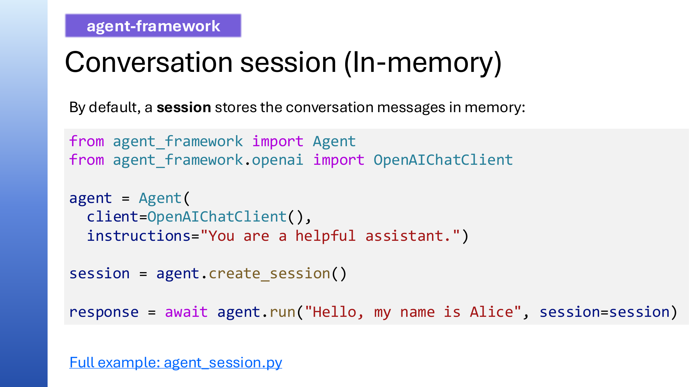  
[Watch from 23:06](https://www.youtube.com/watch?v=BMzI9cEaGBM&t=1386s)

SQLite offers a lightweight, file-based database option for storing chat history with a different schema design: each message is stored as a separate row with session ID and message JSON. This method suits databases with document size limits (e.g., Cosmos DB) and allows efficient retrieval by ordering messages by ID within a session. Implementing this requires subclassing the agent framework’s base history provider and defining methods to save and retrieve messages.

### Introduction to dynamic memory in AI agents

  
[Watch from 28:10](https://www.youtube.com/watch?v=BMzI9cEaGBM&t=1690s)

Dynamic memory enables agents to store and recall specific facts or preferences extracted from conversations. This involves:

- Retrieving relevant memories via search before responding
- Deciding which new facts to store after each interaction
- Updating or deleting obsolete memories over time to reflect changes
- Using persistent storage with support for efficient search (e.g., vector search)

Dynamic memory enhances personalization and makes the agent appear more knowledgeable and adaptive.

### Using Redis for dynamic memory with hybrid search

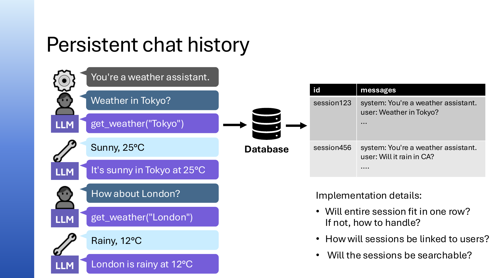  
[Watch from 30:22](https://www.youtube.com/watch?v=BMzI9cEaGBM&t=1822s)

Redis can also support dynamic memory by combining naive storage of all messages with a hybrid search mechanism that merges keyword and vector search results. This approach retrieves only the most relevant memories to provide focused context to the LLM. The agent framework’s built-in Redis context provider handles this, requiring a stable user ID to associate memories with individual users.

### Advanced memory management with MemZero package

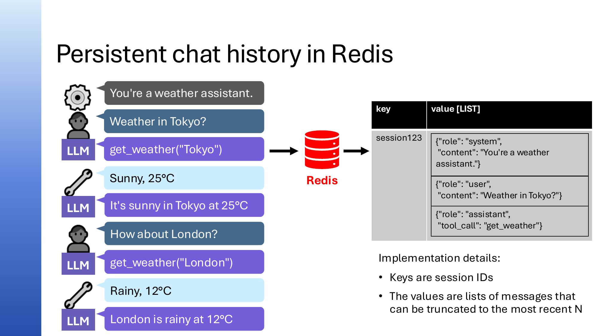  
[Watch from 35:05](https://www.youtube.com/watch?v=BMzI9cEaGBM&t=2105s)

MemZero is an open-source memory management package offering sophisticated dynamic memory. It uses an LLM to analyze agent responses and determine whether to add, update, or delete specific memories. The process involves:

- Extracting potential new memories from the latest response
- Searching existing memories for overlaps or conflicts
- Reasoning about necessary memory updates or removals
- Applying these changes to keep memory relevant and up to date

MemZero supports multiple backend databases and embedding models via an abstraction layer.

### Demonstration of MemZero memory provider integration

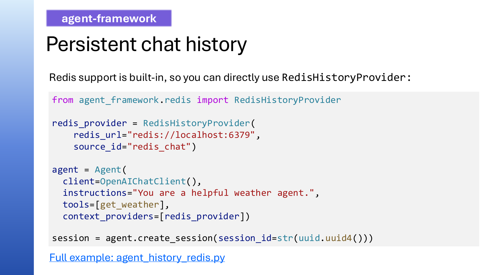  
[Watch from 38:12](https://www.youtube.com/watch?v=BMzI9cEaGBM&t=2292s)

Integrating MemZero with the agent framework requires configuring the LLM, embedding model, and optionally the database. The MemZero memory provider is then passed as a context provider to the agent. During interaction, the provider runs before and after each agent execution to retrieve relevant memories and update them based on the agent’s output. This setup enables more intelligent and concise memory management than naive storage.

### Insights from GitHub Copilot’s memory system

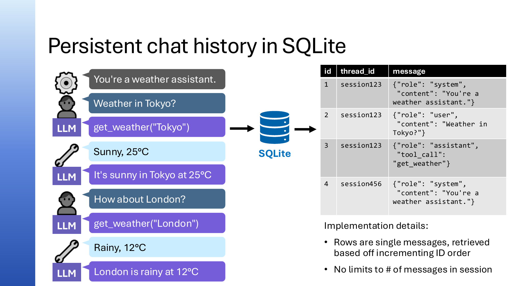  
[Watch from 42:44](https://www.youtube.com/watch?v=BMzI9cEaGBM&t=2564s)

GitHub Copilot uses a clever memory system that ties memories to specific lines of source code, enabling it to mark memories obsolete when code changes. This approach maintains memory relevance in code editing contexts, ensuring the agent adapts to evolving codebases. Such domain-specific memory management strategies inspire similar implementations for other coding agents.

### Knowledge retrieval in AI agents

  
[Watch from 43:49](https://www.youtube.com/watch?v=BMzI9cEaGBM&t=2629s)

Agents often need to retrieve domain-specific knowledge before or alongside tool usage. Knowledge retrieval can be implemented as context providers that always run before the agent executes, adding relevant information to the conversation. This contrasts with knowledge retrieval as tools, which the agent may call selectively. Context providers ensure domain knowledge is consistently available for agent responses.

### SQLite knowledge provider example

  
[Watch from 45:18](https://www.youtube.com/watch?v=BMzI9cEaGBM&t=2718s)

A simple SQLite knowledge provider can implement a `before_run` method that queries a database of domain knowledge based on the user’s input and adds retrieved information as a system message to the conversation context. This method ensures relevant knowledge is always injected before the agent generates a response, improving domain-specific accuracy.

### Hybrid search techniques with PostgreSQL

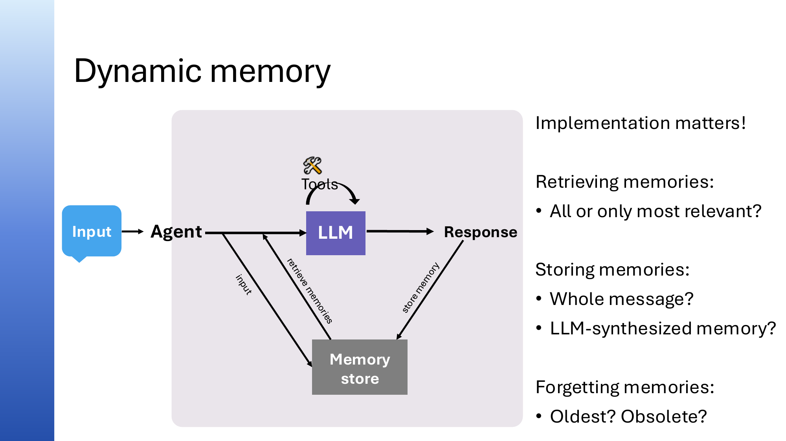  
[Watch from 47:08](https://www.youtube.com/watch?v=BMzI9cEaGBM&t=2828s)

Hybrid search combines keyword (full-text) and vector search to retrieve the most relevant documents. PostgreSQL supports both and can merge results using algorithms like reciprocal rank fusion. This approach balances precise keyword matches with semantic similarity, enhancing retrieval quality for knowledge stores. Hybrid search is a best practice for effective agent knowledge retrieval.

### Query rewriting for improved knowledge retrieval

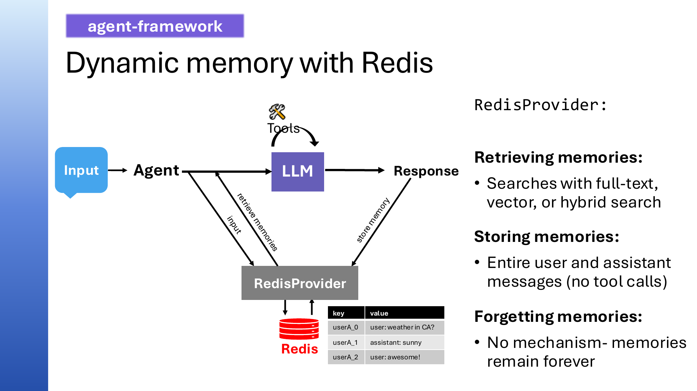  
[Watch from 49:47](https://www.youtube.com/watch?v=BMzI9cEaGBM&t=2987s)

For multi-turn conversations, rewriting the user query optimizes search effectiveness. Instead of using just the most recent user message, the entire conversation is condensed into an optimized search query by an LLM before querying the knowledge store. This additional LLM call improves retrieval relevance by incorporating conversation context into the search input.

### Azure AI Search knowledge base integration

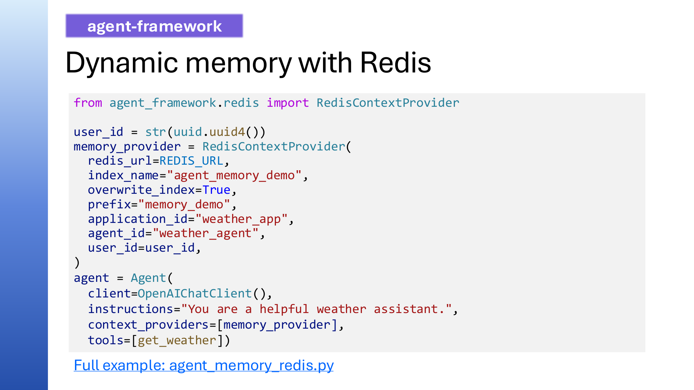  
[Watch from 50:28](https://www.youtube.com/watch?v=BMzI9cEaGBM&t=3028s)

Azure AI Search offers a fully managed knowledge base with built-in features like hybrid search, multi-source querying, parallel searches, iterative retrieval (reflection), and query rewriting. Its deep integration with the agent framework allows easy setup with minimal code, providing a production-ready knowledge provider that enhances retrieval performance and scalability. However, it requires an Azure setup and cannot run within GitHub Codespaces.

### Key takeaways on knowledge retrieval

  
[Watch from 51:18](https://www.youtube.com/watch?v=BMzI9cEaGBM&t=3078s)

Knowledge can be retrieved either as always-on context providers or as selectively-invoked tools. Context providers run before each agent interaction, ensuring consistent domain knowledge availability, whereas tools are called conditionally. Deciding between the two depends on the agent’s use case and whether knowledge should be persistently injected or dynamically queried.

### Context management challenges and context window limits

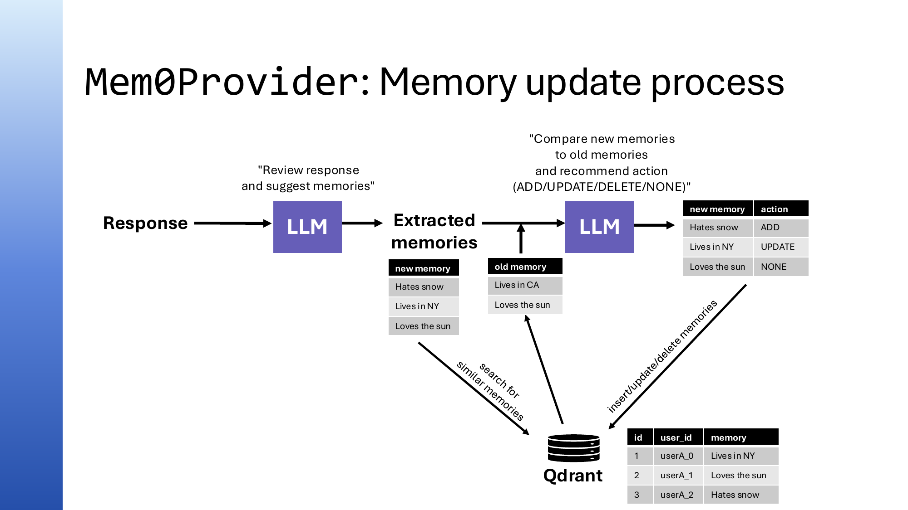  
[Watch from 52:05](https://www.youtube.com/watch?v=BMzI9cEaGBM&t=3125s)

LLMs have finite context windows limiting input token size. Early models handled 4,000 to 12,000 tokens, while newer models support 128,000 to 1 million tokens. Despite larger windows, sending excessive or irrelevant context decreases response quality and increases cost. Efficient context management requires filtering and condensing input to fit within these limits while preserving relevance.

### Context compaction and summarization middleware

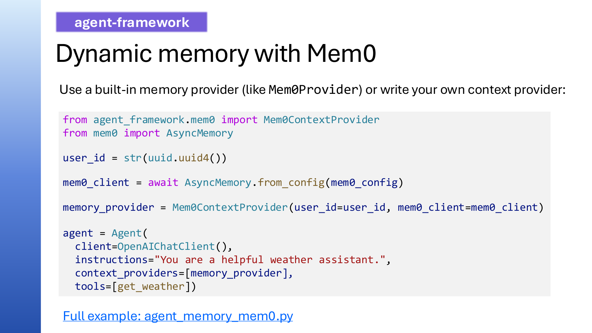  
[Watch from 54:01](https://www.youtube.com/watch?v=BMzI9cEaGBM&t=3241s)

Context compaction summarizes long conversations into concise messages to stay within token limits. This is implemented as middleware intercepting agent runs. When token usage exceeds a threshold, the middleware calls an LLM to generate a summary that replaces the detailed conversation history. This process can be repeated over time, enabling effectively infinite conversations with manageable context size. Configuring the frequency and storage of summarized data is a design decision.

### Using sub-agents to reduce context size

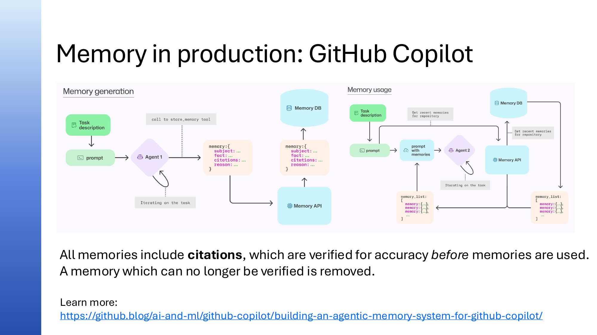  
[Watch from 58:55](https://www.youtube.com/watch?v=BMzI9cEaGBM&t=3535s)

Sub-agents handle specialized tasks or large data (e.g., searching large code files) and return summaries to a coordinator agent. This design reduces the main agent’s context size by delegating heavy retrieval or processing to sub-agents whose outputs are condensed. It is especially useful when tool call results are large and helps maintain focused, efficient context for the primary agent’s decisions.

### Summary and closing remarks

  
[Watch from 01:01:07](https://www.youtube.com/watch?v=BMzI9cEaGBM&t=3667s)

The session concludes with encouragement to join office hours for further questions, access resources including recordings and write-ups, and upcoming sessions on monitoring and evaluating agents. Participants are invited to provide feedback through surveys and continue exploring the agent framework’s capabilities.

## Live Chat Q&A

### How do memory systems handle conflicting or changed user preferences?

Memory systems like MemZero use an LLM to reason about conflicts. If a new memory contradicts an old one (e.g., user previously hated sun but now loves it), the system updates the memory to reflect the latest preference rather than storing both. This dynamic update ensures memories remain accurate over time.

### Is blob storage suitable for chat history persistence?

Blob storage is generally not ideal for chat history due to the high frequency of reads and writes and the need to update conversations incrementally. Blob storage is optimized for large, immutable objects rather than many small updates. Databases with native support for incremental updates and search are preferred.

### What is the difference between using SQLite and vector databases like Chroma for storing chat history?

SQLite stores chat history as structured message records without native vector search capabilities. Vector databases like Chroma enable semantic similarity search on embedding vectors, improving retrieval for dynamic memory or knowledge but may not be optimized for storing full conversation logs. The choice depends on whether semantic search is required.

### When should knowledge retrieval be implemented as a context provider versus a tool?

Use a context provider when knowledge must always be retrieved and injected before agent processing, ensuring consistent domain context. Use a tool when retrieval is conditional and should be invoked selectively by the agent. The decision depends on how integral the knowledge is to every interaction.

### How often should summarization middleware compact conversations?

Summarization frequency depends on the token limit of the LLM and the application’s tolerance for latency. Typically, summarization triggers when the conversation approaches a threshold (e.g., 75% of the context window). Balancing summary detail and freshness is important to maintain response quality.

### Can sessions be shared across multiple agents?

Yes, sessions are portable conversation histories identified by unique IDs. Different agents can load the same session, enabling continuity across agents or devices. Serialization and deserialization of sessions ensure persistence and transferability.

## Discord Office Hours Q&A

### How can we configure the GitHub workspace to call paid, authenticated Azure LLMs?

📹 [0:54](https://youtube.com/watch?v=X0m0GxJRT0Y&t=54)

The [python-agentframework-demos](https://github.com/Azure-Samples/python-agentframework-demos) repo README has instructions for configuring model providers. If you're not using GitHub Models in a Codespace, you need to set up a `.env` file. Options:

- **GitHub Models locally**: Set up a personal access token as described in the README.
- **Azure AI Foundry models**: Use the Bicep provisioning included in the repo (`azd up`) which will write the `.env` file for you automatically. Or manually create a `.env` with your endpoint and chat deployment name.
- **Other providers**: OpenAI, Ollama, etc. are also supported with similar `.env` configuration.

The `.env.sample` shows the required variables: endpoint and chat deployment. By default, keyless authentication is used (no API key). If you want to use a key, you'd need to modify the code. Running `azd up` as suggested in the README will provision the resources and write the `.env` file automatically.

Links shared:

- [python-agentframework-demos README - Using Azure AI Foundry Models](https://github.com/Azure-Samples/python-agentframework-demos?tab=readme-ov-file#using-azure-ai-foundry-models)

### Will this series cover hosting agents in Azure, such as options and best practices?

📹 [4:11](https://youtube.com/watch?v=X0m0GxJRT0Y&t=251)

The original plan was to do a separate follow-up series specifically about hosting agents on Azure, since this series emphasizes code you can run locally (mostly free with GitHub Models). However, there's been a lot of demand for deployment content.

Next week's session (Session 3) will include one deployment example using Azure Container Apps. But there are many more options:

- **Azure Container Apps** — just requires writing a Dockerfile for your Python agent
- **Azure Functions**
- **Container App Jobs** — for long-running workflows
- **Foundry Hosted Agents**

For Container Apps specifically, it's really about writing the right Dockerfile. For example, deploying an agent using the Playwright MCP server requires a Dockerfile that installs both Python and npm/Playwright.

The [official documentation on hosting options](https://learn.microsoft.com/en-us/agent-framework/get-started/hosting?pivots=programming-language-python) covers some of these, though it doesn't mention Container Apps specifically (since that's just a Docker container).

Links shared:

- [Agent Framework hosting documentation](https://learn.microsoft.com/en-us/agent-framework/get-started/hosting?pivots=programming-language-python)
- [Playwright MCP on Azure Container Apps example](https://github.com/simonjj/playwright-mcp-on-aca)

### How should you manage multi-tier memory to store lots of information while keeping local storage manageable?

📹 [7:09](https://youtube.com/watch?v=X0m0GxJRT0Y&t=429)

The session demos used mem0's basic option, but mem0 offers more advanced features including **graph memory** for remembering entities and relationships. User memories typically go into the system prompt, while conversation history stays as messages in the thread — these are handled separately.

For inspiration, look at existing memory systems. For example, you can inspect GitHub Copilot's memory to see what memories are being stored and how summarization works.

Links shared:

- [mem0 Graph Memory documentation](https://docs.mem0.ai/open-source/features/graph-memory)

### Should the original conversation be saved when summarizing, or is it useful to toss the details?

📹 [21:55](https://youtube.com/watch?v=X0m0GxJRT0Y&t=1315)

You could definitely store the original in memory as long as you're not worried about memory constraints (it's just text). For inspiration on how to implement summarization, look at LangChain's built-in summarization middleware — the session's middleware example was inspired by it, though simplified.

A cautionary tale about summarization: Pamela shared an experience where GitHub Copilot compacted a conversation and lost critical context. She said "yes please" to a one-line caption request, but after summarization, Copilot interpreted the "yes please" as agreement to implement an entire plan. Key takeaways:

- Be very careful that summarization retains the most recent context
- Consider only summarizing everything *before* the last message
- In your summarizer prompt, account for short follow-up messages like "yes please" that reference specific prior context
- Set up example conversations as test cases for your summarization to evaluate edge cases like this

Links shared:

- [LangChain context editing middleware](https://github.com/langchain-ai/langchain/blob/94a58825d352e15b2f5a132859b08827f7b208fb/libs/langchain_v1/langchain/agents/middleware/context_editing.py)

### What's a good plan to learn how to build agents with the Agent Framework?

📹 [9:01](https://youtube.com/watch?v=X0m0GxJRT0Y&t=541)

1. **Run all the examples** from the session and make sure you understand them
2. **Ask Copilot questions** about code you don't understand — it can dig into the Agent Framework source code and explain things
3. **Pick one example and build on it** — extend something that already works for a scenario relevant to you (home life, developer workflows, etc.)
4. **Choose a domain you have expertise in** — this is critical because LLMs can be convincingly wrong, so you need to be able to evaluate whether the agent's answers are good

Links shared:

- [Python + Agents Session 1 write-up](../session-1/outputs/writeup.md)

### VS Code often forgets you have a venv in your project — does it swap that knowledge out of its memory?

📹 [11:18](https://youtube.com/watch?v=X0m0GxJRT0Y&t=678)

To investigate what information Copilot actually receives, use the **Chat Debug View**: click the "..." menu in the Copilot chat panel and select "Show Chat Debug View." This reveals everything sent to the LLM, including:

- All available tools
- The full system prompt from GitHub Copilot
- Memory guidelines and stored memories (user and repository memories)
- Environment info (OS, workspace folders)
- Current date, terminal info, last command run

In the demo, the environment info listed the OS as Linux (because of the dev container) and showed workspace folders, but did *not* mention the venv — even though one existed. This might be because the venv is in `.gitignore`. The Python environment tools *should* return this info, but it may not always work correctly. If you encounter this bug, use the thumbs-down button to report an issue — it pre-fills your VS Code info and routes it to the right repo.

### Why would you use Agent Framework instead of the Foundry SDK, and why consider non-Foundry hosting options?

📹 [15:01](https://youtube.com/watch?v=X0m0GxJRT0Y&t=901)

**Foundry SDK / Foundry Agents** run the entire agent loop in the cloud. Benefits:

- Built-in tools (Bing search, code interpreter) are easy to use since the agent is already running in Azure
- Built-in session management with threads — no need to set up your own database
- Less setup overall

**Drawbacks of hosted agents:**

- Less flexibility — you can't add middleware at as many points as with Agent Framework
- If the agentic loop runs in the cloud, it's harder to insert yourself into it and customize
- The portal experience may not expose all SDK capabilities
- Foundry is undergoing significant changes (Classic vs New UI, hub-based vs new projects, agents v1 vs v2)

**When to choose Agent Framework:** If you need deep customization, extensive middleware, or find yourself hitting limitations with the hosted service. You can also host Agent Framework apps on Foundry as "hosted agents" to get some Foundry management benefits.

**When Foundry SDK is fine:** If it has everything you need and you don't find yourself needing more customization.

Links shared:

- [Azure AI Foundry SDK overview](https://learn.microsoft.com/en-us/azure/ai-foundry/how-to/develop/sdk-overview?view=foundry-classic&pivots=programming-language-python)

### Can you confirm that designing your overall project cannot be LLM agnostic?

📹 [17:45](https://youtube.com/watch?v=X0m0GxJRT0Y&t=1065)

The demos use the OpenAI chat completions API, which is widely supported (OpenAI models, Azure OpenAI, Ollama, many others). However, OpenAI has introduced the **Responses API**, which is more agentic:

- Supports built-in tools (code interpreter, web search on Azure)
- Has a notion of state (stateful or stateless)
- Azure is standardizing on Responses API
- Foundry provides a generic Responses API layer across *all* its models (DeepSeek, Mistral, Llama, etc.)

The series used chat completions because **GitHub Models doesn't support Responses API yet**, and the demos were designed to run on GitHub Models. In production, the recommendation is to use **Responses API** for maximum model agnosticism when models are on Foundry — you can then point at any Foundry model and your code will work.

Links shared:

- [AI Model Starter Kit (Responses API examples)](https://github.com/Azure-Samples/ai-model-start?tab=readme-ov-file#the-ai-model-starter-kit)

### What are the issues with Foundry?

📹 [30:27](https://youtube.com/watch?v=X0m0GxJRT0Y&t=1827)

There's a lot changing in the Foundry ecosystem:

- **Two kinds of projects**: hub-based projects and the new Foundry projects
- **Two UIs**: Foundry Classic and Foundry New — some features work in one but not the other
- **Two agent service versions**: agents v1 and agents v2
- **Breaking changes** as things evolve

You need to keep track of which kind of project you're in, which UI you're using, and which agent service version you're on.

### Is Foundry IQ using GraphRAG with knowledge graphs?

📹 [31:34](https://youtube.com/watch?v=X0m0GxJRT0Y&t=1894)

First, clarification on the three "IQ" services at Microsoft:

- **Foundry IQ** — basically Azure AI Search's knowledge-base feature
- **Fabric IQ** — built on top of Microsoft Fabric ontologies
- **Work IQ** — built on top of Microsoft Graph, available as an MCP server

Foundry IQ does **not** use GraphRAG at this point. The AI Search team has looked into it but hasn't found a good way to productionize graph RAG queries efficiently with consistent results. The team is also exploring other retrieval improvements like **ColBERT** (multi-vector embeddings), but the challenge is always making research approaches work at production scale for everyone.

Links shared:

- [Weaviate multi-vector embeddings tutorial](https://docs.weaviate.io/weaviate/tutorials/multi-vector-embeddings)

### Is there any middleware for context caching that can cut down on token usage?

📹 [33:32](https://youtube.com/watch?v=X0m0GxJRT0Y&t=2012)

There are two different kinds of caching to consider:

**LLM-level caching** (handled by the model provider):

- Anthropic models have long-context caching
- OpenAI models cache structured output JSON schemas (first call is slow, subsequent calls are faster)
- Many LLMs implement system prompt caching — if you keep the first N tokens of the system prompt the same, they'll be cached
- You can take advantage of this by keeping your system prompt prefix stable

**Middleware-level token reduction** (your code):

- Truncation — removing oldest messages (risks losing important context)
- Heuristic-based removal — e.g., LangChain's context editing middleware clears older tool results after a certain number
- The key is having a heuristic that doesn't require an LLM call to determine what to remove
- Always evaluate whether your heuristic still produces good results

### Does model routing save tokens?

📹 [39:45](https://youtube.com/watch?v=X0m0GxJRT0Y&t=2385)

Model routing can save costs by using cheaper LLMs for simpler questions. It can also indirectly reduce token usage because some LLMs are more verbose than others — for example, some models generate 10 different queries for AI Search while others generate only 2. You can also control verbosity through system prompts or by cutting off excessive tool calls.

Links shared:

- [Performance Benchmarking LLM Models (Anthony Shaw)](https://tonybaloney.github.io/posts/performance-benchmarking-llm-models.html)

### Do we have examples with App Service and UV on Azure?

📹 [36:54](https://youtube.com/watch?v=X0m0GxJRT0Y&t=2214)

App Service for Linux announced UV support in November 2025 via a [blog post](https://techcommunity.microsoft.com/blog/appsonazureblog/what%E2%80%99s-new-for-python-on-app-service-for-linux-pyproject-toml-uv-and-more/4468903). Gwen Sadler (from the team) has been working with the App Service team on this. Attendees reported issues getting it to work — Gwen and others were encouraged to collaborate and report any bugs to the App Service team.

Links shared:

- [What's new for Python on App Service for Linux: pyproject.toml, UV, and more](https://techcommunity.microsoft.com/blog/appsonazureblog/what%E2%80%99s-new-for-python-on-app-service-for-linux-pyproject-toml-uv-and-more/4468903)

### Is it possible to use skills (like GitHub Copilot skills) in the Microsoft Agent Framework?

📹 [38:17](https://youtube.com/watch?v=X0m0GxJRT0Y&t=2297)

Yes! Support was just recently added. The .NET support shipped first, and Python support was merged as a [PR #4210](https://github.com/microsoft/agent-framework/pull/4210). It's implemented as a **context provider** — if you have skills defined in the file system, you can advertise them to the agent. To try it, you'll need to point your dependency at the latest main branch of the Agent Framework, update the git hash, run `uv sync`, and test it out.

Links shared:

- [Agent Framework PR #4210 - Python agent skills support](https://github.com/microsoft/agent-framework/pull/4210)

### What about the TOON notation format for reducing token usage?

📹 [41:44](https://youtube.com/watch?v=X0m0GxJRT0Y&t=2504)

Be cautious about new notation formats designed to save tokens. Research (shared by Drew Brunig) found that **saving a handful of tokens in the data format is wasted if models are not trained on the format**. In testing, TOON actually consumed *more* tokens because models didn't understand the syntax and couldn't use it well.

The same principle applies generally: we benefit enormously from the fact that LLMs know existing formats like YAML deeply — they understand its syntax, know PyYAML for parsing, and can interact with it in many ways. Even if everyone "silently hates YAML," it works well with LLMs because they're trained on it extensively.

For context-related topics, Pamela recommended following Drew Brunig, who is writing a book on the subject.

Links shared:

- [TOON format](https://github.com/toon-format/toon)
